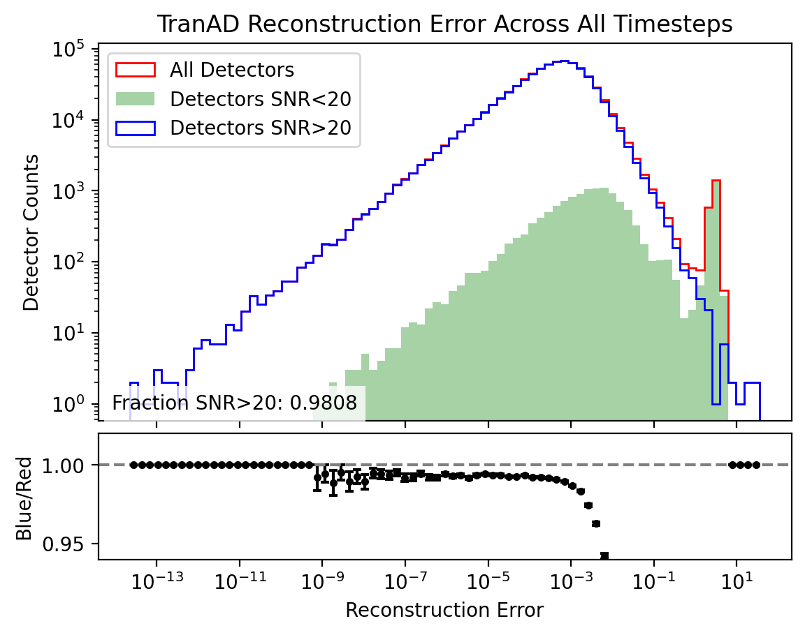
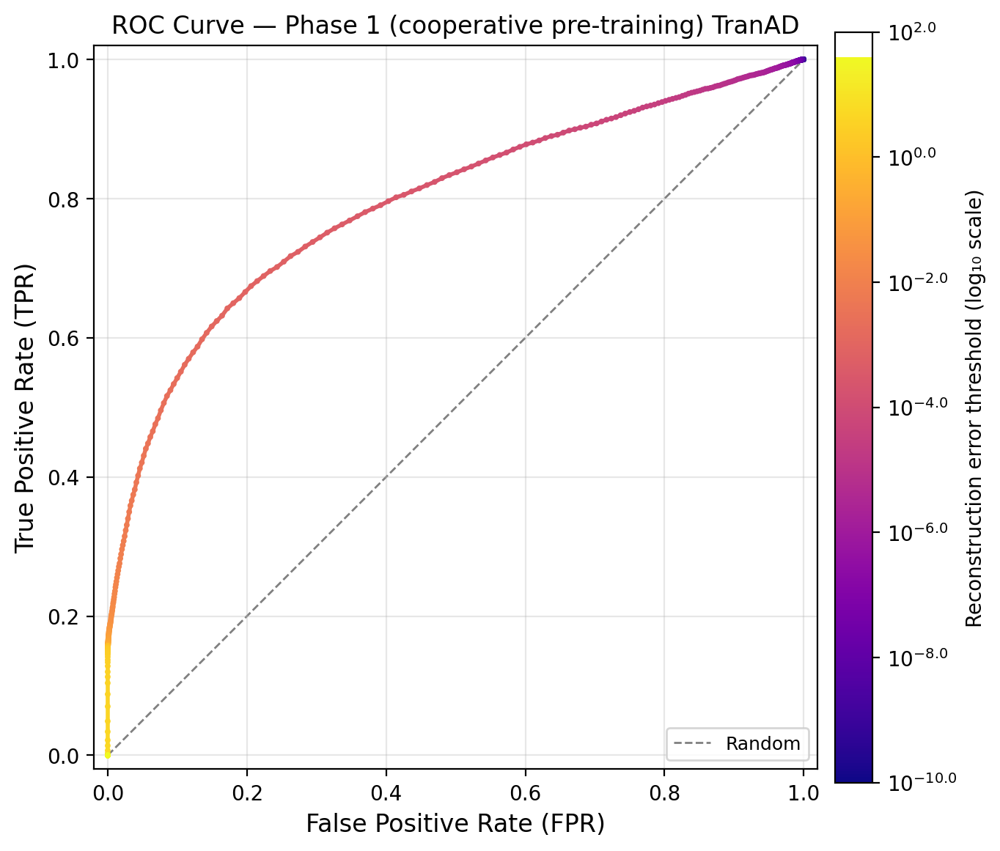
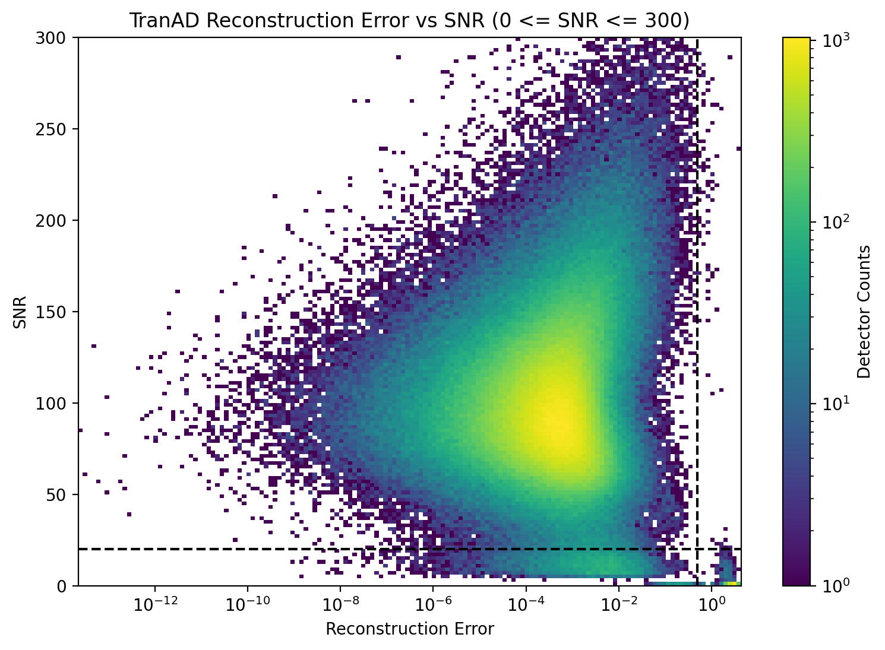

# SPT Histograms

The SPT histogram workflow (`scripts/spt/plot_spt_histogram.py`) trains TranAD on the SNR data variant, runs inference, and compares the model's reconstruction error against the traditional per-detector SNR heuristic in 1D and 2D histograms.

For the SPT SNR dataset, `channel_labels` holds the raw per-detector SNR value aligned to each `(time, detector)` entry rather than a binary label, which is what makes this direct comparison possible. See [Analysis and Scoring](../../technical_docs/analysis/analysis_and_scoring.md) for the underlying loading, training, and inference stages.

## 1D Histogram

For the 1D histogram, reconstruction error is the anomaly score: larger reconstruction error means the model found that detector-time sample harder to reconstruct, so it is treated as more anomalous.

The red `all detectors` distribution shows a clear peak at high reconstruction error. Once the detectors with `SNR < 20` are removed, that high-error peak largely disappears in the blue histogram. This is the main qualitative result of the plot: TranAD is assigning large anomaly scores to the same low-SNR detector population that the traditional cut already identifies as problematic.

The green histogram, which corresponds to the `SNR < 20` subset, still peaks at high reconstruction error, but it also has a long tail extending to lower reconstruction error. That tail matters because it means the ML score does not cleanly separate all low-SNR detectors from the rest with a single very loose threshold. Some detectors that the traditional SNR rule would flag still receive only moderate or low reconstruction error.

This histogram is therefore best interpreted as a threshold scan. If we place a cut at some reconstruction-error value and label everything above that threshold as anomalous, then moving the cut left or right trades false positives against true positives. Sweeping that cut produces the ROC curve below.

At low false-positive rate, the true-positive rate is not as high as we would ideally want. That follows directly from the long low-error tail in the green `SNR < 20` distribution: many traditionally bad detectors are easy for the model to reconstruct, so they are only recovered after lowering the ML threshold enough to also admit more false positives.

## 2D Histogram

The 2D histogram places the traditional and ML anomaly scores on the same figure without making any additional cuts. The y-axis is the traditional score based on raw detector SNR, while the x-axis is the ML score based on reconstruction error.

Two reference lines divide the plot into four quadrants:

- the horizontal line marks the traditional cut at `SNR = 20`
- the vertical line marks an ML cut at reconstruction error `0.5`

This gives a simple interpretation of each quadrant:

- top left: detector samples that look normal to both methods, with acceptable SNR and low reconstruction error
- bottom right: an isolated island of detector samples flagged by both methods, with low SNR and high reconstruction error
- top right: detector samples with acceptable SNR but high reconstruction error, which are candidates for anomalies that the pure SNR heuristic would miss
- bottom left: detector samples with `SNR < 20` but fairly low reconstruction error, meaning the traditional cut flags them while the model does not score them as strongly anomalous

The most interesting structure is that the bottom-right island is clearly separated from the top-left bulk population. That shows the model is not assigning high scores randomly; it is concentrating them in the same region where the standard low-SNR rule already says detector quality is poor. At the same time, the non-empty top-right and bottom-left quadrants show that the ML score is not just a trivial copy of the SNR threshold. The two scoring schemes overlap strongly, but they are not identical, which is exactly why this comparison is useful.

## Related Pages

- [SPT Overview](index.md)
- [SPT Data Loading](data_loading.md)
- [SPT Preprocessing](preprocessing.md)
- [SPT Training](training.md)
- [Core Workflow](../../overview/methodology/core_workflow.md)
- [Inference](../../technical_docs/inference/index.md)
- [Inference Pipeline](../../technical_docs/inference/inference_pipeline.md)
- [Analysis](../../technical_docs/analysis/index.md)
- [Analysis and Scoring](../../technical_docs/analysis/analysis_and_scoring.md)
