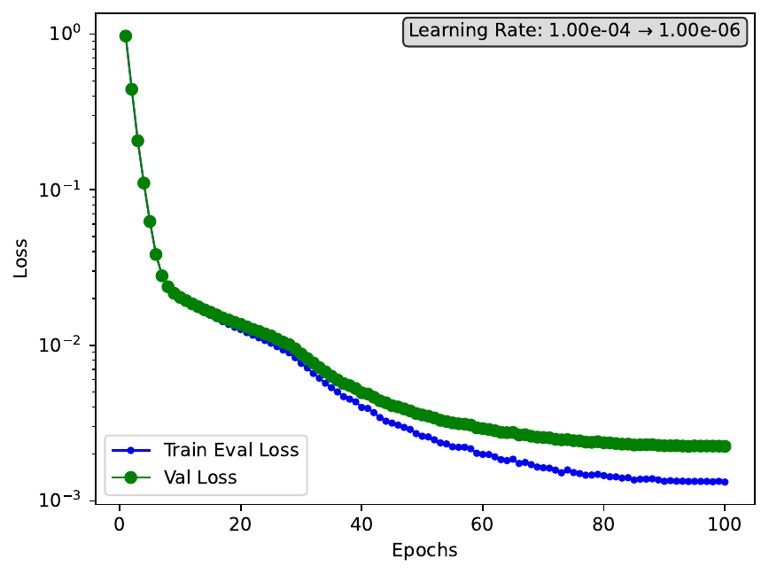

# SPT Training

This page documents how SPT datasets are trained in the shared `anldq` training pipeline.

## Entry Points

The SPT training flow uses the same shared interfaces as every other dataset:

```python
from anldq.configs import TrainConfig
from anldq.datasets import load_dataset
from anldq.trainer import build_trainer

cfg = TrainConfig.from_yaml("src/anldq/configs/train_config/tranad.yml")
train, val, test = load_dataset("spt", data_variant="snr", label_from_snr=True)
trainer = build_trainer(cfg, dataset=train)
trainer.train(train, val)
```

The SPT-specific behavior comes from the dataset shape and preprocessing choices, not from a separate trainer implementation.

## Typical Model Setup

The worked SPT example uses TranAD with the config in:

- `src/anldq/configs/train_config/tranad.yml`

Notable defaults in the current config include:

- `model: tranad`
- `epochs: 100`
- `batch_size: 256`
- `learning_rate: 0.0001`
- `tranad_arch.n_window: 10`
- `tranad_arch.d_model: 256`
- `scheduler: CosineAnnealingLR`
- `early_stopping: true`

## How SPT Reaches The Trainer

The SPT dataset returned by `load_dataset()` has shape `(T, C, 1)`. The trainer then:

1. inspects the dataset shape
2. resolves model and architecture settings
3. windows the time series for the selected model
4. creates dataloaders for train and validation
5. runs the epoch loop with checkpointing and early stopping

This is the same training loop documented in the shared training page, but for SPT the important point is that the detector axis stays explicit until model preparation and later comes back out again as a `(T, C)` error map during inference.

## Response Versus SNR Training

SPT can train on either:

- `data_variant="response"`
- `data_variant="snr"`

The histogram workflow uses the `snr` variant because the downstream plots compare reconstruction error directly against raw per-detector SNR.

In that workflow, the call is:

```python
train, val, test = load_dataset(
    "spt",
    data_variant="snr",
    label_from_snr=True,
    trim_test_timestamps=False,
)
```

The important setting here is `label_from_snr=True`, which preserves raw SNR values as `test.channel_labels` for later plotting.

## Artifacts

After training, the run directory contains the usual training artifacts:

- checkpoints
- `loss_curve.pdf`
- `loss_curve.csv`
- `run_info.md`

Here is the loss curve produced with the training defaults used for this SPT example.



The run directory is derived from the loaded `TrainConfig` through `cfg.io.get_experiment_dir(cfg.run_id)`.

## Related Pages

- [SPT Overview](index.md)
- [SPT Data Loading](data_loading.md)
- [SPT Preprocessing](preprocessing.md)
- [SPT Histograms](histograms.md)
- [Training](../../technical_docs/training/index.md)
- [Training Pipeline](../../technical_docs/training/training_pipeline.md)
- [Inference](../../technical_docs/inference/index.md)
- [Inference Pipeline](../../technical_docs/inference/inference_pipeline.md)
- [Analysis](../../technical_docs/analysis/index.md)
- [Analysis and Scoring](../../technical_docs/analysis/analysis_and_scoring.md)
